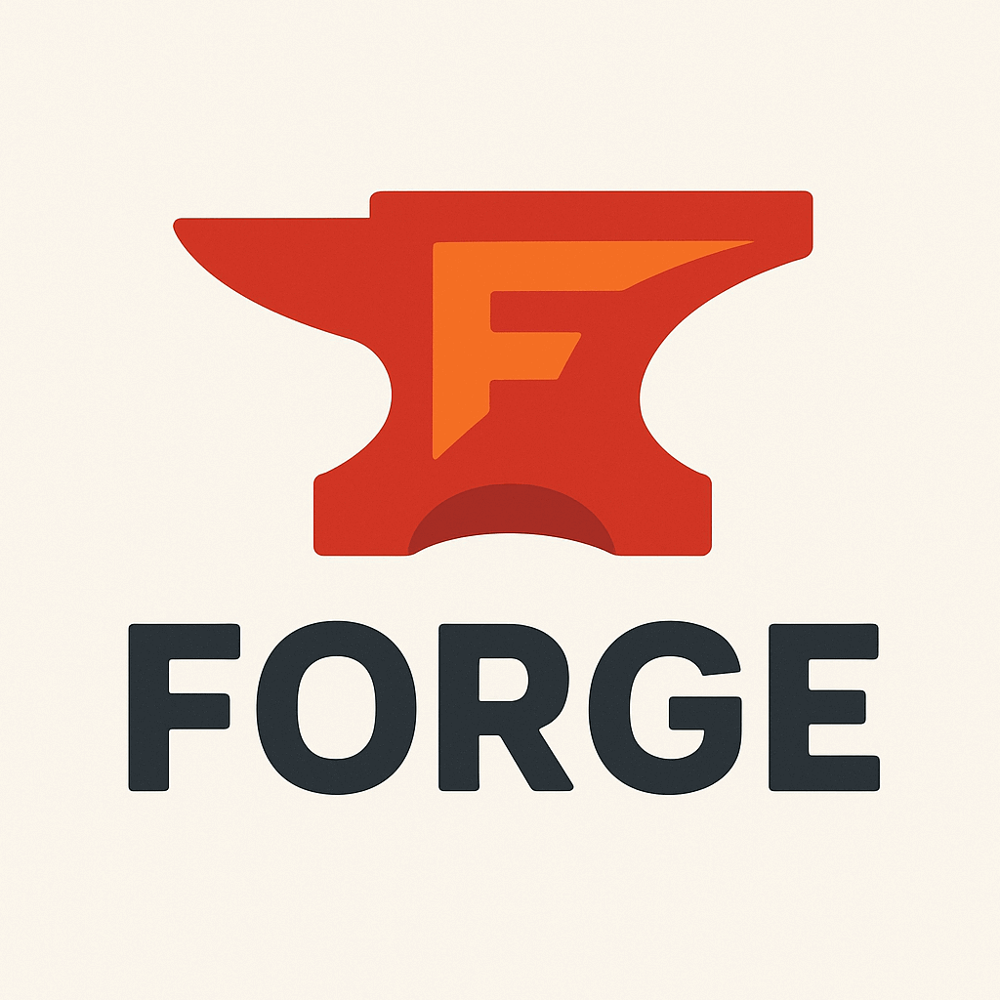

## Forge

Has nothing to do with game modding...

Forge is an experimental C frontend & preprocessor (and aspiring full compiler toolchain) written in Go

Forge is a learning-oriented, just-for-fun experiment to build something that walks and talks like a real compiler — starting with a C preprocessor, then growing into a full frontend capable of parsing C into an AST.

It’s not production-ready. It’s not meant to replace gcc or clang. It’s here because compilers are fun, weird, and full of opportunities to learn about language design, parsing, and toolchain internals.

## Features (so far)

### 📝 Custom Preprocessor

Handles #define macros (simple replacements)

Handles #include with cycle detection

Expands macros in regular code lines

### 🛠 Written in Go

Leverages Go’s strong standard library for file handling, regex, and scanning

Keeps things minimal and approachable

### 🧪 Testable Design

Processing functions are easy to test with in-memory strings

Step-by-step development, one feature at a time

## Roadmap

This is not a promise — more like a treasure map:

- Preprocessor (#define, #include, conditional compilation)

- Lexical analysis (scanner/lexer for C source)

- Parsing into an Abstract Syntax Tree (AST)

- Semantic analysis (types, scopes)

- Code generation (likely to an intermediate format, maybe LLVM IR)

## Why?

- Because compilers are magic until you peek inside them.
- Because writing one teaches you how languages really work.
- Because C is both a nightmare and a wonder of software history.

## Status

🚧 Highly experimental. Expect broken things, strange behavior, and an overuse of fmt.Printf debugging.
